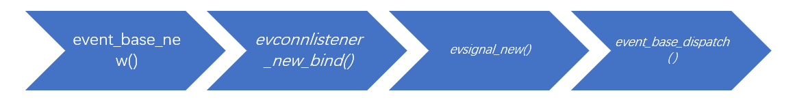

# Libevent源码分析 (1) hello-world

⑨月份接触了久闻大名的libevent，当时想读读源码，可是由于事情比较多一直没有时间，现在手头的东西基本告一段落了，我准备读读libevent的源码，凡是我觉得有必要的内容均一一记录，与君共勉。

首先要说说什么是libevent:

> libevent是一个事件通知库，libevent API提供一种机制使得我们可以在一个文件描述符(file descriptor)发生特定事件时或者timeout发生时执行指定的回调函数。libevent意图代替事件驱动服务器上的事件循环。应用程序只需要调用event_dispatch()，然后动态添加或者删除事件，而不需要修改事件循环

## 1.构建环境
+ libevent 2.1.x
+ windows10(linux的epoll以后再说,先看看libevent对于IOCP的包装吧)

如何构建环境可以参见官方教程Build and Install,非常简单，基本上可以直接cmake。 由于我构建的环境不使用openssl,所以option(EVENT__DISABLE_OPENSSL OFF)要修改为 option(EVENT__DISABLE_OPENSSL ON)，然后直接生成解决方案。

## 2. 相逢#pragram push_macro
如果你和我一样编译过程中遇到error: static declaration of 'strtok_r' follows non-static declaration可以在前面加上一行#ifndef EVENT__HAVE_STRTOK_R。 重点是这里我学到了一个没用过的功能
```cpp

#define A "Hello"
    std::cout << A << std::endl;        //Hello
#pragma push_macro("A")
#define A "World"
#pragma push_macro("A")
#define A ":)"
    std::cout << A << std::endl;        //:)
#pragma pop_macro("A")
    std::cout << A << std::endl;        //World
#pragma pop_macro("A")
    std::cout << A << std::endl;        //Hello
```
注意别漏了A的双引号。可以看出push_macro/pop_macro的确是实现了栈的效果。为了再确认一下我们看看_clang_的实现：
```cpp
///   #pragma push_macro("macro")
void Preprocessor::HandlePragmaPushMacro(Token &PushMacroTok) {
  ...
  IdentifierInfo *IdentInfo = ParsePragmaPushOrPopMacro(PushMacroTok);
  // Get the MacroInfo associated with IdentInfo.
  MacroInfo *MI = getMacroInfo(IdentInfo);
  // Push the cloned MacroInfo so we can retrieve it later.
  PragmaPushMacroInfo[IdentInfo].push_back(MI);
}
///   #pragma pop_macro("macro")
void Preprocessor::HandlePragmaPopMacro(Token &PopMacroTok) {
  ...
  // Find the vector<MacroInfo*> associated with the macro.
  llvm::DenseMap<IdentifierInfo*, std::vector<MacroInfo*> >::iterator iter =
    PragmaPushMacroInfo.find(IdentInfo);
  if (iter != PragmaPushMacroInfo.end()) {

    // Pop PragmaPushMacroInfo stack.
    iter->second.pop_back();
    if (iter->second.empty())
	  PragmaPushMacroInfo.erase(iter);
 
  }
}
```
## 3. libevent的hello-world

回到主题，这系列文章从libevent/sample/hello-world.c开始。hello-world.c是一个日常socket IO程序，当客户端通过9995端口与服务器连接后服务器持续发送Hello, World!，不过现在用的是libevent事件回调实现的。
```cpp
int
main(int argc, char **argv)
{
	struct event_base *base;
	struct evconnlistener *listener;
	struct event *signal_event;

    struct sockaddr_in sin;
#ifdef _WIN32	//在win上需要用WAStartup初始化winsock dll才能使用socket
	WSADATA wsa_data;
	WSAStartup(0x0201, &wsa_data);
#endif

///////////////////////////////////////////////////////////////////////////
/// 1.event_base_new使用默认设置创建一个指向event_base的指针
///////////////////////////////////////////////////////////////////////////
	base = event_base_new();
	if (!base) {
		fprintf(stderr, "Could not initialize libevent!\n");
		return 1;
	}

	memset(&sin, 0, sizeof(sin));
	sin.sin_family = AF_INET;
	sin.sin_port = htons(PORT);

///////////////////////////////////////////////////////////////////////////
/// 2.evconnlistener_new_bind分配一个connection监听对象，当有新TCP连接时执行
/// listener_cb回调
///////////////////////////////////////////////////////////////////////////
	listener = evconnlistener_new_bind(base, listener_cb, (void *)base,
	    LEV_OPT_REUSEABLE|LEV_OPT_CLOSE_ON_FREE, -1,
	    (struct sockaddr*)&sin,
	    sizeof(sin));

	if (!listener) {
		fprintf(stderr, "Could not create a listener!\n");
		return 1;
	}
///////////////////////////////////////////////////////////////////////////
/// 3. evsignal_new是一个#define evsignal_new(b, x, cb, arg) \
///                   event_new((b), (x), EV_SIGNAL|EV_PERSIST, (cb), (arg))
///////////////////////////////////////////////////////////////////////////
	signal_event = evsignal_new(base, SIGINT, signal_cb, (void *)base);

	if (!signal_event || event_add(signal_event, NULL)<0) {
		fprintf(stderr, "Could not create/add a signal event!\n");
		return 1;
	}
///////////////////////////////////////////////////////////////////////////
/// 4. event_base_dispatch等价于event_base_loop(event_base, 0)，当一切准备就绪
/// 后就可以执行它，event_base_dispatch会一直运行，直到没有任何注册事件或者用户调用
/// event_base_loopexit
///////////////////////////////////////////////////////////////////////////
	event_base_dispatch(base);

///////////////////////////////////////////////////////////////////////////
/// 5. 堆释放
///////////////////////////////////////////////////////////////////////////
	evconnlistener_free(listener);
	event_free(signal_event);
	event_base_free(base);

	printf("done\n");
	return 0;
}
```
上面就是一个libevent的通用模板：首先创建event_base，然后绑定服务器socket监听端口并注册事件回调，最后开启事件循环，剩下的工作就是编写各个事件的回调。 当然别忘了释放内存。

## 4.提前结束
归纳一下hello-world用到的libevent APIs：

这系列文章要分析的就是上图的四个函数，它们包含了libevent一个完整的生命周期。最开始我准备所有内容写到一篇，后面发现实在太长了，读起来累，逻辑也混乱(函数调用栈太长了)，所以我打算逐章分析它们。 enjoy!